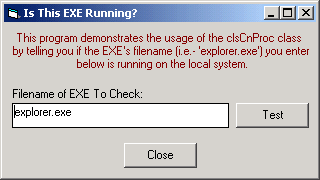



## Process Info, Traversal & Conversion \(PID/EXE/WinTitle/Class/hWnd\) Class \- NT4 Friendly

### Description

This class module provides a process manipulation abstraction layer that will work across all Win32 operating systems in addition to a completely unique process information conversion function. NT4's process information interface differs greatly from Win95+, but with this lightweight class these differences are abstracted thru the class’s interface. The process conversion function of this class allows you to activity convert between a window’s ProcessID, hWnd, Window Title, Class Name and EXE name. Given any one of these, the Convert() function will convert it into another! Ever needed to figure out the hWnd of a window and only had the EXE name? Or needed the ProcessID for a window title beginning with “Adobe”? The Convert() function in this class will do these conversions and more! I’ve provided a simple example program to demonstrate the basic interface to this class. Be sure to take a look at the class itself in order to learn about all of its features and capabilities! This class has been very well tested, but your mileage may vary. If you find a bug or would like to suggest an improvement, please let me know! Thanks and enjoy!
 
### More Info
 

             |
---                |---
**Submitted On**   |2002-08-28 16:36:48
**By**             |[Nick Campbeln](https://github.com/Planet-Source-Code/PSCIndex/blob/master/ByAuthor/nick-campbeln.md)
**Level**          |Beginner
**User Rating**    |4.8 (29 globes from 6 users)
**Compatibility**  |VB 5\.0, VB 6\.0
**Category**       |[Windows System Services](https://github.com/Planet-Source-Code/PSCIndex/blob/master/ByCategory/windows-system-services__1-35.md)
**World**          |[Visual Basic](https://github.com/Planet-Source-Code/PSCIndex/blob/master/ByWorld/visual-basic.md)
**Archive File**   |[Process\_In1237798282002\.zip](https://github.com/Planet-Source-Code/nick-campbeln-process-info-traversal-conversion-pid-exe-wintitle-class-hwnd-class-nt4-frie__1-38425/archive/master.zip)

